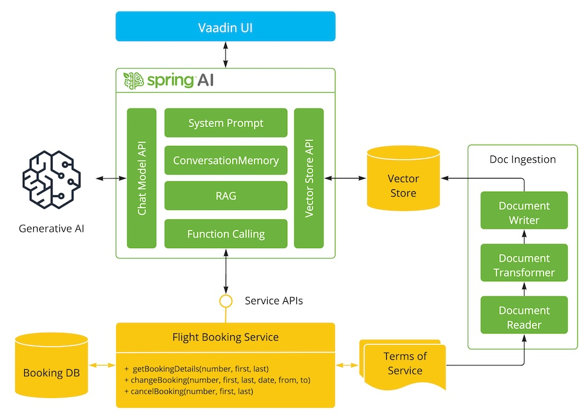
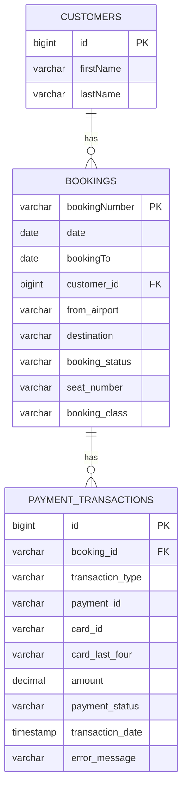

# 🛫 Flight Booking Assistant - Spring AI Demo

Uma aplicação de assistente de atendimento ao cliente para reservas de voos, demonstrando o poder do **Spring AI** com integração de LLM, RAG (Retrieval Augmented Generation), Function Calling e MCP (Model Context Protocol).



## 📋 Índice

- [Visão Geral](#-visão-geral)
- [Arquitetura](#-arquitetura)
- [Tecnologias](#-tecnologias)
- [Pré-requisitos](#-pré-requisitos)
- [Instalação e Execução](#-instalação-e-execução)
- [APIs REST](#-apis-rest)
- [Spring AI Tools](#-spring-ai-tools)
- [Modelo de Dados](#-modelo-de-dados)
- [Observabilidade](#-observabilidade)
- [MCP Integration](#-mcp-integration)

## 🎯 Visão Geral

Esta aplicação demonstra um sistema de atendimento ao cliente inteligente para uma companhia aérea fictícia (Funnair). O assistente pode:

- 🔍 Consultar detalhes de reservas
- ✏️ Alterar datas e rotas de voos
- ❌ Cancelar reservas
- 💳 Processar pagamentos via MCP
- 📊 Registrar transações no banco de dados
- 🪑 Selecionar assentos interativamente
- 📚 Responder perguntas usando RAG com termos de serviço

## 🏗️ Arquitetura

### Diagrama de Componentes

```mermaid
graph TB
    subgraph "Frontend"
        UI[Vaadin UI<br/>Chat + Grid]
    end

    subgraph "Backend - Spring Boot"
        CA[CustomerSupportAssistant<br/>Spring AI Chat Client]
        BT[BookingTools<br/>@Tool Functions]
        FBS[FlightBookingService<br/>Business Logic]
        BTC[BookingToolsController<br/>REST API]
        
        subgraph "Data Layer"
            BR[BookingRepository]
            CR[CustomerRepository]
            PTR[PaymentTransactionRepository]
        end
    end

    subgraph "External Services"
        LLM[OpenAI GPT-4o<br/>LLM Provider]
        MCP[MCP Payment Server<br/>SSE Connection]
        VS[Chroma<br/>Vector Store]
    end

    subgraph "Database"
        PG[(PostgreSQL<br/>+ pgvector)]
    end

    subgraph "Observability"
        PROM[Prometheus<br/>Metrics]
        GRAF[Grafana<br/>Dashboards]
        TEMPO[Tempo<br/>Traces]
        LOKI[Loki<br/>Logs]
    end

    UI --> CA
    UI --> BTC
    CA --> BT
    CA --> LLM
    CA --> VS
    CA --> MCP
    BT --> FBS
    BTC --> BT
    FBS --> BR
    FBS --> CR
    FBS --> PTR
    BR --> PG
    CR --> PG
    PTR --> PG
    
    CA -.Metrics.-> PROM
    CA -.Traces.-> TEMPO
    CA -.Logs.-> LOKI
    PROM --> GRAF
    TEMPO --> GRAF
    LOKI --> GRAF
```

### Fluxo de Dados

1. **Usuário** interage via chat na interface Vaadin
2. **CustomerSupportAssistant** processa a mensagem usando Spring AI
3. **LLM (GPT-4o)** decide quais ferramentas chamar
4. **BookingTools** executa funções de negócio (@Tool)
5. **FlightBookingService** aplica regras de negócio
6. **Repositories** persistem dados no PostgreSQL
7. **MCP Server** processa pagamentos (quando necessário)
8. **Observability Stack** coleta métricas, traces e logs

## 🛠️ Tecnologias

### Backend
- **Java 21** - Linguagem de programação
- **Spring Boot 3.3.5** - Framework principal
- **Spring AI 1.0.0** - Integração com LLMs
- **Vaadin 24.8** - Framework UI
- **Hibernate/JPA** - ORM
- **PostgreSQL** - Banco de dados relacional
- **Chroma** - Vector database para RAG

### AI & ML
- **OpenAI GPT-4o** - Modelo de linguagem
- **Spring AI Tools** - Function calling
- **Vector Store** - Embeddings para RAG
- **MCP (Model Context Protocol)** - Integração com serviços externos

### Observabilidade
- **Micrometer** - Métricas
- **OpenTelemetry** - Traces distribuídos
- **Prometheus** - Coleta de métricas
- **Grafana** - Visualização
- **Tempo** - Armazenamento de traces
- **Loki** - Agregação de logs

## 📦 Pré-requisitos

- **Java 21+**
- **Maven 3.8+**
- **Docker & Docker Compose**
- **OpenAI API Key**

## 🚀 Instalação e Execução

### 1. Clone o Repositório

```bash
git clone <repository-url>
cd playground-flight-booking
```

### 2. Configure a API Key

Edite `src/main/resources/application.properties`:

```properties
spring.ai.openai.api-key=YOUR_OPENAI_API_KEY
```

### 3. Inicie a Infraestrutura

```bash
docker-compose up -d
```

Isso iniciará:
- PostgreSQL (porta 5432)
- Chroma Vector Store (porta 8000)
- Prometheus (porta 9091)
- Grafana (porta 3000)
- Tempo (porta 3200)
- Loki (porta 3100)

### 4. Carregue os Dados Iniciais

```bash
cat src/main/resources/db/init-database.sql | docker exec -i playground-flight-booking-main3_postgres_1 psql -U postgres -d vector_store
```

### 5. Execute a Aplicação

```bash
./mvnw spring-boot:run
```

Ou compile e execute o JAR:

```bash
./mvnw clean install -DskipTests
java -jar target/playground-flight-booking-0.0.1-SNAPSHOT.jar
```

### 6. Acesse a Aplicação

- **Interface Web**: http://localhost:8080
- **Grafana**: http://localhost:3000
- **Prometheus**: http://localhost:9091

## 🔌 APIs REST

### Base URL
```
http://localhost:8080/api/bookings-tools
```

### Endpoints

#### 1. Obter Detalhes da Reserva

```http
GET /api/bookings-tools/bookings?bookingNumber={number}&firstName={first}&lastName={last}
```

**Parâmetros:**
- `bookingNumber` (string, required): Número da reserva
- `firstName` (string, required): Primeiro nome do cliente
- `lastName` (string, required): Sobrenome do cliente

**Resposta de Sucesso (200):**
```json
{
  "bookingNumber": "101",
  "firstName": "John",
  "lastName": "Doe",
  "date": "2025-11-21",
  "bookingStatus": "CONFIRMED",
  "from": "LAX",
  "to": "JFK",
  "seatNumber": "12A",
  "bookingClass": "ECONOMY"
}
```

#### 2. Alterar Reserva

```http
PUT /api/bookings-tools/bookings
Content-Type: application/json
```

**Body:**
```json
{
  "bookingNumber": "101",
  "firstName": "John",
  "lastName": "Doe",
  "newDate": "2025-12-01",
  "from": "LAX",
  "to": "SFO"
}
```

**Resposta de Sucesso:** `204 No Content`

**Regras de Negócio:**
- Alterações permitidas até 24 horas antes do voo
- Taxa: $50 (Economy), $30 (Premium Economy), Grátis (Business)

#### 3. Cancelar Reserva

```http
DELETE /api/bookings-tools/bookings
Content-Type: application/json
```

**Body:**
```json
{
  "bookingNumber": "101",
  "firstName": "John",
  "lastName": "Doe"
}
```

**Resposta de Sucesso:** `204 No Content`

**Regras de Negócio:**
- Cancelamento permitido até 48 horas antes do voo
- Taxa: $75 (Economy), $50 (Premium Economy), $25 (Business)

#### 4. Utilitários

##### Data e Hora Atual
```http
GET /api/bookings-tools/utils/current-datetime
```

##### Soma de Inteiros
```http
GET /api/bookings-tools/utils/sum-integers?numberA=10&numberB=20
```

##### Soma de Decimais
```http
GET /api/bookings-tools/utils/sum-decimals?numberA=10.5&numberB=20.3
```

##### Subtração
```http
GET /api/bookings-tools/utils/subtract?numberA=50&numberB=20
```

## 🤖 Spring AI Tools

As ferramentas abaixo são expostas ao LLM via `@Tool` annotation e podem ser chamadas automaticamente durante a conversa:

### 1. get-booking
**Descrição:** Obtém detalhes de uma reserva

**Parâmetros:**
- `bookingNumber` (String)
- `firstName` (String)
- `lastName` (String)

**Retorno:** `BookingDetails`

### 2. change-booking
**Descrição:** Altera data e rota de uma reserva

**Parâmetros:**
- `bookingNumber` (String)
- `firstName` (String)
- `lastName` (String)
- `newDate` (String) - formato: YYYY-MM-DD
- `from` (String) - código IATA do aeroporto
- `to` (String) - código IATA do aeroporto

### 3. cancel-booking
**Descrição:** Cancela uma reserva

**Parâmetros:**
- `bookingNumber` (String)
- `firstName` (String)
- `lastName` (String)

### 4. log-payment-transaction
**Descrição:** Registra uma transação de pagamento após processamento via MCP

**Parâmetros:**
- `bookingNumber` (String)
- `transactionType` (String) - CANCELLATION, CHANGE, REFUND
- `paymentId` (String) - ID retornado pelo MCP
- `cardId` (String)
- `cardLastFour` (String)
- `amount` (Double)
- `success` (Boolean)

**Retorno:** Mensagem de confirmação

### 5. current-date-time
**Descrição:** Retorna data e hora atual

**Retorno:** String formatada (dd/MM/yyyy HH:mm:ss)

### 6. sum-two-integers
**Descrição:** Soma dois números inteiros

**Parâmetros:**
- `numberA` (int)
- `numberB` (int)

**Retorno:** int

### 7. sum-two-decimal
**Descrição:** Soma dois números decimais

**Parâmetros:**
- `numberA` (double)
- `numberB` (double)

**Retorno:** double

### 8. difference-two-numbers
**Descrição:** Subtrai dois números

**Parâmetros:**
- `numberA` (int)
- `numberB` (int)

**Retorno:** int

## 📊 Modelo de Dados

### Entidades

#### Customer
```java
@Entity
@Table(name = "customers")
public class Customer {
    @Id
    @GeneratedValue(strategy = GenerationType.IDENTITY)
    private Long id;
    
    private String firstName;
    private String lastName;
    
    @OneToMany(mappedBy = "customer")
    private List<Booking> bookings;
}
```

#### Booking
```java
@Entity
@Table(name = "bookings")
public class Booking {
    @Id
    private String bookingNumber;
    
    private LocalDate date;
    private LocalDate bookingTo;
    
    @ManyToOne(fetch = FetchType.EAGER)
    private Customer customer;
    
    private String from;           // from_airport
    private String to;             // destination
    private BookingStatus bookingStatus;
    private String seatNumber;
    private BookingClass bookingClass;
}
```

#### PaymentTransaction
```java
@Entity
@Table(name = "payment_transactions")
public class PaymentTransaction {
    @Id
    @GeneratedValue(strategy = GenerationType.IDENTITY)
    private Long id;
    
    @ManyToOne
    private Booking booking;
    
    private TransactionType transactionType;
    private String paymentId;
    private String cardId;
    private String cardLastFour;
    private Double amount;
    private PaymentStatus paymentStatus;
    private LocalDateTime transactionDate;
    private String errorMessage;
}
```

### Enums

- **BookingStatus**: `CONFIRMED`, `CANCELLED`
- **BookingClass**: `ECONOMY`, `PREMIUM_ECONOMY`, `BUSINESS`
- **TransactionType**: `CANCELLATION`, `CHANGE`, `REFUND`
- **PaymentStatus**: `SUCCESS`, `FAILED`, `PENDING`

### Diagrama ER



## 📈 Observabilidade

### Métricas Disponíveis

A aplicação expõe métricas via Actuator:

```
http://localhost:8080/actuator/prometheus
```

**Métricas Principais:**
- `gen_ai_client_operation` - Operações do cliente AI
- `db_vector_client_operation` - Operações do vector store
- `spring_ai_chat_client` - Métricas do chat client
- `spring_ai_tool` - Execução de ferramentas
- `http_server_requests` - Requisições HTTP

### Traces Distribuídos

Traces são enviados para o Tempo via OpenTelemetry:

- **Endpoint**: http://localhost:9411/api/v2/spans
- **Sampling**: 100% (configurável)

### Logs

Logs são enviados para o Loki e podem ser visualizados no Grafana.

**Arquivo de log local:**
```bash
tail -f target/starter-webflux-server.log
```

### Dashboards Grafana

Acesse http://localhost:3000 para visualizar:
- Métricas de performance
- Traces de requisições
- Logs agregados
- Métricas de AI (tokens, latência, etc.)

## 🔗 MCP Integration

### Configuração

A aplicação se conecta a um servidor MCP via SSE (Server-Sent Events):

```properties
spring.ai.mcp.client.enabled=true
spring.ai.mcp.client.sse.connections.travelServer.url=http://localhost:8085
spring.ai.mcp.client.sse.connections.travelServer.sse-endpoint=/sse
```

### Servidor MCP

O servidor MCP fornece ferramentas adicionais para:
- Processamento de pagamentos
- Validação de cartões
- Cálculos de taxas

### Fluxo de Pagamento

1. Usuário solicita cancelamento/alteração
2. Assistente calcula a taxa
3. Solicita dados do cartão
4. Chama ferramenta MCP para processar pagamento
5. MCP retorna `paymentId` e status
6. Assistente chama `log-payment-transaction` para registrar
7. Transação é salva no banco de dados

## 🧪 Testes

### Executar Testes

```bash
./mvnw test
```

### Testar Manualmente

1. Acesse http://localhost:8080
2. Digite no chat: "Quero ver minha reserva 101, John Doe"
3. Teste cancelamento: "Quero cancelar minha reserva"
4. Forneça dados do cartão quando solicitado

## 📝 Dados de Teste

### Clientes e Reservas

| Booking | Nome | Status | Data | Rota | Assento | Classe |
|---------|------|--------|------|------|---------|--------|
| 101 | John Doe | CONFIRMED | 2025-11-21 | LAX → JFK | 12A | ECONOMY |
| 102 | Jane Smith | CONFIRMED | 2025-11-23 | SFO → LHR | 5B | BUSINESS |
| 103 | Michael Johnson | CONFIRMED | 2025-11-25 | JFK → CDG | 18C | ECONOMY |
| 104 | Sarah Williams | CONFIRMED | 2025-11-27 | LHR → FRA | 3A | PREMIUM_ECONOMY |
| 105 | Robert Taylor | CONFIRMED | 2025-11-29 | CDG → MAD | 15D | BUSINESS |

### Cartão de Teste

```
Número: 4012888888881881
CVV: 222
```

## 🐛 Troubleshooting

### Erro: "Failed to export spans"

**Causa:** OpenTelemetry tentando conectar ao servidor na porta 4317

**Solução:** Ignorar (não afeta funcionalidade) ou configurar servidor OTLP

### Erro: "Booking not found"

**Causa:** Dados não carregados ou nome incorreto

**Solução:** Execute o script de inicialização do banco

### Erro: "HikariPool connection failed"

**Causa:** PostgreSQL não está rodando

**Solução:** 
```bash
docker-compose up -d postgres
```

## 📚 Referências

- [Spring AI Documentation](https://docs.spring.io/spring-ai/reference/)
- [Vaadin Documentation](https://vaadin.com/docs)
- [OpenAI API](https://platform.openai.com/docs)
- [MCP Protocol](https://modelcontextprotocol.io/)
- [Chroma Vector Database](https://www.trychroma.com/)

## 📄 Licença

Este é um projeto de demonstração para fins educacionais.

## 👥 Contribuindo

Contribuições são bem-vindas! Por favor, abra uma issue ou pull request.

---

**Desenvolvido com ❤️ usando Spring AI**